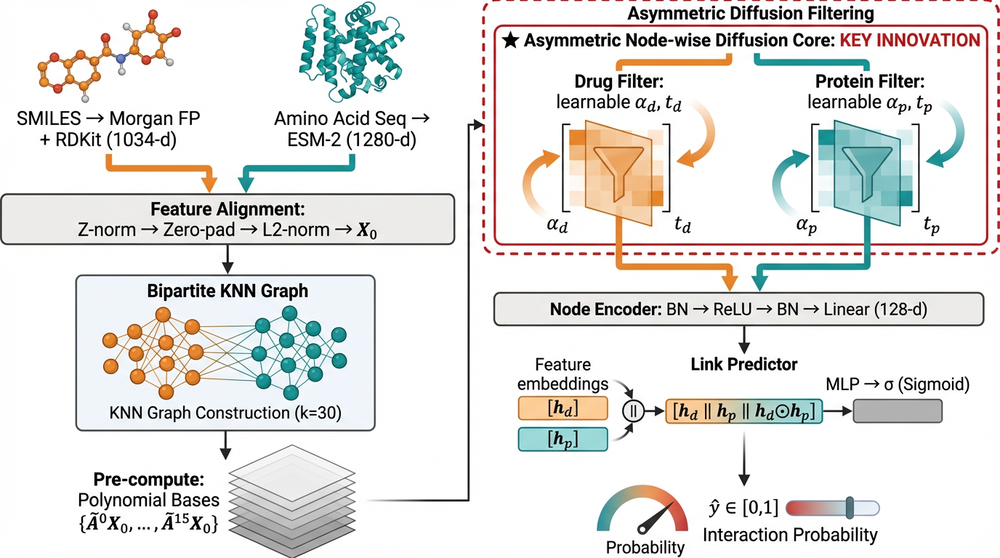

# FracDTI

**Fractional-Order Graph Diffusion for Drug-Target Interaction Prediction**

<p align="center">
  
</p>

FracDTI introduces learnable fractional-order spectral graph filters for DTI prediction. Unlike conventional integer-order diffusion (e.g., GCN, PPR), FracDTI learns separate diffusion orders α_drug and α_prot, enabling asymmetric propagation depths for drug and protein graphs.

## Key Features

- **Fractional-order spectral filter**: `h(λ) = (1 + tλ)^{-α}` with learnable `α` and `t`
- **Asymmetric diffusion**: separate `α_drug` / `α_prot` capture distinct graph topologies
- **Cold-start evaluation**: rigorous hold-out of unseen drugs or proteins
- **KNN graph enhancement**: cosine-similarity edges to complement sparse bipartite graphs

## Datasets

Four benchmark datasets are included (graph structure files):

| Dataset | Drugs | Proteins | Interactions |
|---------|-------|----------|-------------|
| DrugBank | 708 | 1,512 | 1,923 |
| BioSNAP | 4,510 | 2,181 | 13,397 |
| BindingDB | 8,647 | 1,607 | 19,135 |
| Human | 2,726 | 2,001 | 6,728 |

## Installation

```bash
git clone https://github.com/LIUYellowBlack/fracdti.git
cd fracdti
pip install -r requirements.txt
```

## Data Preparation

The repository includes graph structure files (edges, node lists, negative samples). Before training, you need to generate node feature files:

```bash
# Fast mode (CPU only, no deep learning dependencies):
python src/data_proc_pretrained.py --dataset biosnap --mode fast

# ESM-2 mode (requires fair-esm + GPU, produces higher-quality protein embeddings):
python src/data_proc_pretrained.py --dataset biosnap --mode esm --device cuda:0

# Generate for all datasets:
for d in biosnap human DrugBank bindingdb; do
    python src/data_proc_pretrained.py --dataset $d --mode fast
done
```

This generates `data/{dataset}/AllNodeAttribute_DrPr_pretrained.csv` containing:
- **Drugs**: 1024-bit Morgan fingerprints + RDKit 2D descriptors
- **Proteins**: ESM-2 embeddings (esm mode) or AAC + DPC features (fast mode)

## Quick Start

### Warm-start (10-fold CV)

```bash
python src/frac_train.py --model frac --dataset biosnap --mode warm --device cuda:0
```

### Cold-start (unseen drugs / proteins)

```bash
# Cold-drug
python src/frac_train.py --model frac --dataset biosnap --mode cold --cold_type drug --device cuda:0

# Cold-target
python src/frac_train.py --model frac --dataset biosnap --mode cold --cold_type target --device cuda:0
```

### Key arguments

| Argument | Description | Default |
|----------|-------------|---------|
| `--model` | `frac` or `fracadapt` | `frac` |
| `--dataset` | `biosnap`, `DrugBank`, `bindingdb`, `human` | `biosnap` |
| `--mode` | `warm` (10-fold CV) or `cold` (hold-out) | `warm` |
| `--cold_type` | `drug` or `target` | `drug` |
| `--graph_mode` | `knn` or `full` | `knn` |
| `--knn_k` | Number of KNN neighbors | `30` |
| `--K` | Polynomial order for spectral filter | `15` |
| `--epochs` | Training epochs | `500` |

After training, the learned diffusion parameters (α_drug, α_prot, t_drug, t_prot) are printed and saved for analysis.

## Project Structure

```
fracdti/
├── src/
│   ├── frac_model.py            # FracDTI model (fractional-order graph filter)
│   ├── frac_train.py            # Training & evaluation (warm / cold-start)
│   ├── utils.py                 # Data loading utilities
│   └── data_proc_pretrained.py  # Pretrained feature generation
├── data/
│   ├── DrugBank/                # DrugBank dataset
│   ├── biosnap/                 # BioSNAP dataset
│   ├── bindingdb/               # BindingDB dataset
│   └── human/                   # Human dataset
├── assets/
│   └── architecture_overview.png
├── requirements.txt
└── README.md
```

## Citation

If you find this work useful, please cite:

```bibtex
@article{liu2025fracdti,
  title={FracDTI: Fractional-Order Graph Diffusion for Drug-Target Interaction Prediction},
  author={Liu, Jiongxin},
  year={2025}
}
```

## License

MIT License
